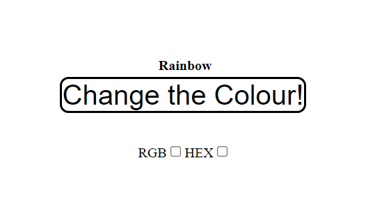
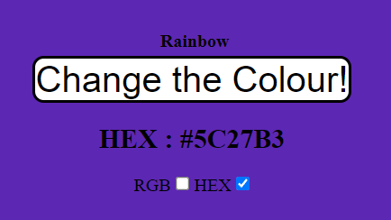
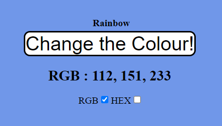
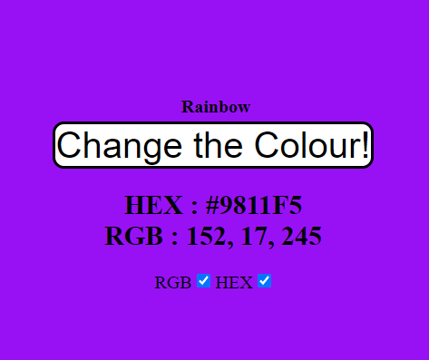

# Color-Generator

  Simple app where when you press a button to cahnge the color of the screen
  
  Also has a button that when pressed starts going through the colors of the rainbow
  
  There are 2 toggles that the user can select or not, in order to show the value of the color in HEX or RGB
 
# Technologies

- HTML
- CSS
- JavaScript
- VSCode
- jQuery

# Screenshots

---

---

---

